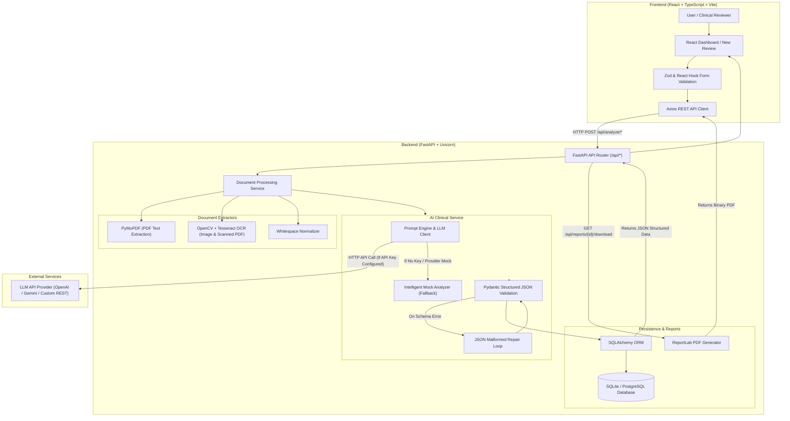
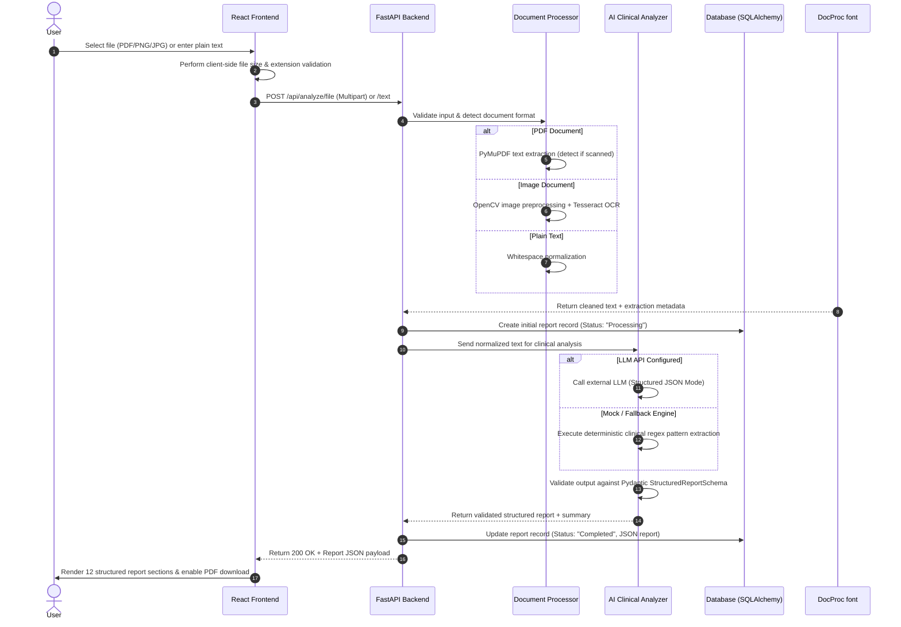

# ClinReview AI – System Architecture Documentation

This document describes the high-level system architecture, data processing flow, document extraction pipeline, AI extraction service, and database persistence layers of **ClinReview AI**.

---

## 1. System Architecture Diagram

---

## 2. Document Processing Pipeline Sequence

---

## 3. Data Flow & Security Layer

- **Safe Temporary Memory Processing:** Files uploaded via multipart endpoints are read directly into memory buffers without exposing permanent static server file URLs.
- **Environment Key Isolation:** `AI_API_KEY` and database credentials remain strictly in backend environment variables and are never exposed to the client bundle.
- **Fail-Safe Processing States:** If document processing or AI JSON validation encounters unrecoverable errors, the database record status is updated to `"Failed"` with error details, preventing corrupted records from appearing as successfully completed.
